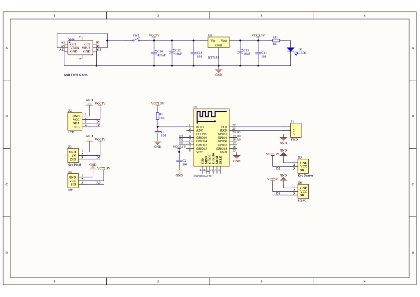
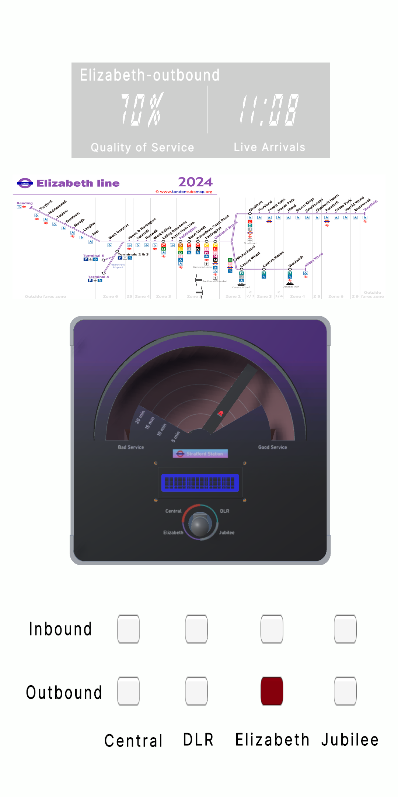

# CASA0019: Sensor Data Visualisation 24/25: SubRadar
<p align="center">
  
</p>

## Table of Contents
1. [Project Overview](#project-overview)
2. [Enclosure & Industrial Design](#enclosure-&-industrial-design)
3. [Data](#data)
4. [Device Engineering (Physical & Digital)](#device-engineering)
5. [Challenges & Limitations](#challenges-and-limitations)
6. [How to use](#how-to-use)
7. [References](#references)

## Project Overview
The **SubRadar** project is a sensor-based system that visualizes real-time transportation data for Stratford Underground Station. Combining physical and digital elements, it provides train arrival times, service quality, and directional updates to people working and studying at UCL East. Users interact with the device through a rotary knob, button, and LED indicators.

### Rationale
Oftentimes, when using applications such as Citymapper or Google Maps, it can take some time to plot in a route or check the latest train times. This project therefore aimed to distill this information into a physical dial device, with digital elements, such that students and staff preparing to leave UCL East after class or work would be able to, at a glance, get all the latest information on the nearest underground trains with minimal effort. It was hoped that through a unique radar-inspired dial, this information could be presented to the UCL East audience in a novel and engaging way.

## Enclosure & Industrial Design

### Inspiration
SubRadar draws largely on sources such as classic science fiction. This is because we wanted the appearance of the dial to emulate a vaccum-tube type device in order to make reference to the classic green or red circular radar scopes of the past. The homage to historical radar is intentional; we wanted to emulate this familiar, classic device that also aimed to show the proximity of moving vehicles to a fixed station. 


*An oscilloscope, a type of device that traditionally used a vaccum-tube display (Wikipedia, 2025)*

However, without a vaccuum-tube display available to us, we had to simulate the effect using stage special effect techniques. In particular, we took inspiration from Michael Okuda, the graphic designer for Star Trek: The Next Generation. In an interview with Adam Savage (formerly of Mythbusters), he described how he used lights placed behind dark coloured acrylic to create the impression of a touch-screen display (Savage, 2024). We used a similar approach, with LEDs placed behind frosted acrylic to create the grainy effect of a vaccum-tube display.


*Michael Okuda's backlit graphic designs for Star Trek, affectionately known by fans as 'Okudagrams' (Nguyen, 2015)*

### Main enclosure

The physical design was developed in Fusion360 and printed on a Bambu Lab 3D printer. To make the design look more appealing, inspiration was taken from Jony Ive's earlier designs for Apple, (Ravenscroft, 2019) using Fusion360's NURBS surface manipulation tool to create a curved back shell that creates an optical illusion, making the device look much thinner than it is in reality.


*Screenshots from Fusion360 showing the curved design of the back shell*

### User interface and experience

#### Wirerframes 

#### Front panel with final UI


*Test fitting the front face, made of acrylic, to the 3D printed rear enclosure shell*


*The major device components coming together, showing the difference made by adding the UV printed graphics*

The final UI was adapted from the wireframe designs to fit the dimensions of the pysical enclosure as built. These were then prepared for UV printing using GIMP and printed on a laser-cut piece of black acrylic. The graphics were printed using a technique very similar to screen printing, with 2 layers of white laid down before the final colour print, in an attempt to ensure the print had sufficient opacity. A piece of frosted red acrylic was chosen instead of the intital transparent purple colour in the original wireframe design, as it offered nice visual effects with the backlighting, that mimicked the appearance of a vaccuum-tube display very well.

## Data
### Data Source
The project utilizes the [Transport for London (TfL) Unified API](https://api.tfl.gov.uk/swagger/ui/index.html?url=/swagger/docs/v1#!/Line/Line_Arrivals) to access real-time data on public transportation. This API provides comprehensive information across various transport modes, including live arrivals, line statuses, and station details. By integrating this API, the project ensures accurate and up-to-date data, enhancing the reliability and 

*Used Data:*
| **Field Name**       | **Meaning**                                | **Purpose**                                                                                         |
|-----------------------|--------------------------------------------|-----------------------------------------------------------------------------------------------------|
| `lineName`           | Line name                                  | Used to distinguish data for different lines                                                       |
| `expectedArrival`    | Scheduled arrival time                     | Used to calculate service interval variability                                                     |
| `timeToStation`      | Remaining time to arrival                  | Used to calculate passenger waiting time                                                           |
| `direction`          | Train direction                            | Used to distinguish service levels for different directions                                        |

In order to measure the Overall Service Level, the group proposed an integrated index - **Overall Service Level**, which offers a comprehensive evaluation of transport service quality by combining key metrics such as ```Service Interval Variability``` and ```Passenger Waiting Time```. It provides an integrated measure of overall service stability and efficiency, with higher scores reflecting better service quality.

| Metric | Method | Required Fields | Explanation |
| --- | --- | --- | --- |
| ```Service Interval Variability``` | Calculate the time intervals between consecutive trains using ```expectedArrival``` and compute the standard deviation. | ```expectedArrival```, ```lineName``` | A smaller standard deviation indicates more stable and reliable services, while larger values suggest irregular and less dependable operations.|
| ```Passenger Waiting Time``` | Analyze the average timeToStation (remaining time for train arrival). | ```timeToStation```, ```lineName``` | Shorter waiting times indicate higher service efficiency, while longer times suggest inadequate service, impacting passenger experience. |
| ```Overall Service Level``` | 0.5 * **Service Interval Variability** + 0.5* **Passenger Waiting Time** | ```Service Interval Variability```, ```Passenger Waiting Time``` | A composite metric assessing overall service stability and efficiency. Higher scores indicate better service quality. |


*Output Data:*
| **Field Name**       | **Meaning**                                | **Purpose**                                                                                         |
|-----------------------|--------------------------------------------|-----------------------------------------------------------------------------------------------------|
| `timeToStation`           | Time for the nearest tube to the station                                 | Notify user                                                       |
| `serviceLevel`    | Line's overall service level(50%*Passenger Waiting Time + 50%*Service Interval Variability)                    |                  Demonstrate the line's service level                                    |

### Data Processing
The preprocessing of raw data involves three key steps: **data cleaning**, **filtering**, and **transformation**. These steps ensure that the data is clean, consistent, and ready for further analysis.

**1. Data Cleaning**

Data cleaning focuses on handling missing or incomplete data. For instance, the script ```fetch_and_process.py``` checks whether the API returns valid data. If no data is received for a specific line or direction, the system prints a warning message and skips further processing for that update:

```python
if not api_data:
    print(f"No data received for line {line_name}, direction {direction}. Skipping update.")
    continue
```

**2. Data Filtering**

To ensure relevance and avoid redundancy, the data filtering process includes:

- **Removing Duplicate Train Information**: Only unique train data is retained to prevent duplication.

- **Direction-Based Filtering**: The data is further refined by selecting train information specific to a given direction. For example, in ```fetch_and_process.py```, unique train data is filtered based on the specified direction. If no valid data is found, the system skips further processing:

    ```python
    unique_trains = filter_unique_trains(api_data, direction)

    if not unique_trains:
        print(f"No valid unique trains data for line {line_name}, direction {direction}. Skipping update.")
        continue
    ```

**3. Data Transformation**

The transformation process ensures that the data is standardized and ready for use by converting raw API responses into a consistent JSON format. Train arrival times are reformatted to follow a uniform time structure, making the data easier to process and analyze. Additionally, directions such as "inbound" and "outbound" are mapped to standardized terms like "westbound" and "eastbound" to enhance clarity and consistency across the system.


### Data Management System
<p align="center">
  
</p>

The data management system depicted in the diagram ensures efficient handling and flow of information across the project. Data from TfL (Transport for London) is retrieved using Python scripts and processed in the Pi Cloud, where it is further distributed. The server, connected to the cloud, facilitates advanced computations and real-time updates.

MQTT is used to transmit processed data from the Pi Cloud to the physical device, enabling it to display real-time information such as train schedules and service quality. Simultaneously, the digital device receives updates directly from the server, ensuring synchronized data representation across both devices. This system leverages a cloud-based architecture to manage data acquisition, processing, and distribution seamlessly.


## Data Device
### DATA DEVICE (Physical)

#### Board & Sensor
| Specification         | **ESP8266**                                                                                                                                                       | **Rotary Encoder**                                                                                              | **Servo**                                                                                                       | **NeoPixel**                                                                                                    | **16x2 LCD**                                                                                                    |
|-----------------------|-------------------------------------------------------------------------------------------------------------------------------------------------------------------|----------------------------------------------------------------------------------------------------------------|-----------------------------------------------------------------------------------------------------------------|----------------------------------------------------------------------------------------------------------------|----------------------------------------------------------------------------------------------------------------|
| **Microcontroller**   | Tensilica L106 32-bit RISC processor, clocked at 80 MHz (can be overclocked to 160 MHz)                                                                           | -                                                                                                              | -                                                                                                               | -                                                                                                              | -                                                                                                              |
| **Operating Voltage**  | 3.3V                                                                                                                                                             | -                                                                                                              | 4.8V to 6V                                                                                                      | 5V                                                                                                              | 5V                                                                                                              |
| **Digital I/O Pins**   | 16                                                                                                                                                               | -                                                                                                              | -                                                                                                               | **Data Pin**: GPIO0 (D2)<br> **Brightness**: 30 (0-255)<br> **Number of LEDs**: 16                              | **SDA Pin**: GPIO2 (D4)<br> **SCL Pin**: GPIO14 (D5)                                                            |
| **Analog Input Pins**  | 1 (10-bit ADC)                                                                                                                                                    | -                                                                                                              | -                                                                                                               | -                                                                                                              | -                                                                                                              |
| **Library Used**       | -                                                                                                                                                               | -                                                                                                              | Servo                                                                                                           | Adafruit NeoPixel                                                                                               | LiquidCrystal_I2C                                                                                               |
| **Documentation**      | [ESP8266 Documentation](https://www.espressif.com/en/products/socs/esp8266)                                                                                     | [Rotary Encoder Link](https://example.com/rotary-encoder)                                                      | [Servo Motor Documentation](https://circuitdigest.com/article/servo-motor-working-and-basics)                   | [NeoPixel Documentation](https://www.adafruit.com/neopixel)                                                    | [16x2 LCD Documentation](https://www.watelectronics.com/lcd-16x2/)                                              |

#### Schematics
<p align="center">
  
</p>


#### Firmware Design
**Firmware Modules and Logic**

- Initialization Module

    Upon powering up, the firmware's Initialization Module configures the LCD, LEDs, servos, and network connections, including WiFi and MQTT setup for data communication. It also schedules periodic tasks like button monitoring and rotary encoder detection to enable user interaction.

- Input Processing Module

    The Input Processing Module interprets rotary encoder signals and button presses to execute actions like menu navigation or function selection, ensuring prompt and accurate device response.

- Display Control Module

    The Display Control Module manages LED indicators, the LCD screen, and servos to provide real-time updates, display line and direction information, and indicate service levels through visual outputs.

**Development Tools and Frameworks**

The firmware is developed in C++ using the *Arduino Integrated Development Environment (IDE)*, a robust platform with extensive libraries and community support. It utilizes Arduino core libraries for hardware abstraction and peripheral management, simplifying interactions with sensors and actuators. For MQTT communication, the `PubSubClient` library is employed to facilitate efficient message handling and seamless data exchange with the digital twin system.


## Digital Dashboard

The dashboard in Android application is shown in figures below, it includes four main components:


- Overview Panel

    This panel includes the train name, line direction, real-time service value, and expected arrival time. The function is to present important data in a direct and prominent way, allowing users to capture key information as soon as they open the app.

- Map of Each Train Line

    This map indicates all of the stations in the current train line, it can help users to navigate towards their destinations.

- Digital Twin of Physical Gauge

    The interface of this gauge is same with physical gauge, the pointer can smoothly transitions to the corresponding angle based on the “quality of service” value, the specific animation effect achieved through Mathf.Lerp. In addition, there are five lights on the pointer, and they will show a "light up" effect based on the train's expected arrival time. This effect is achieved by ShowObjectBasedOnRange method, which makes objects appear or disappear according to time value.

- Line Selection Buttons

    Each button means a specific direction of a train line. For instance, the following figures display the information for the Central line with inbound direction and the Elizabeth line with outbond direction. Users can interact by clicking the buttons, and when a button is pressed, the three components above will switch to display the related information. The eight buttons are arranged in a table-like layout, making it convenient for users to understand the difference of each button.

<p align="center">
  
</p>


## Challenges & Limitations

### Enclosure and product design
Designing and building the enclosure was filled with many challenges, primarily due to the ambitiously curved nature of the rear shell. It took multiple tries to successfully print the component, and the precision of the Bambu Lab printer was largely the reason why the final print succeeded. For the UV printing of the front face with the UI, this turned out to be mostly successful on the first try, but the component still suffered from some of the print being off registration and the black acrylic, though it worked well to prevent light leaking from inside the device, also made it difficult to achieve good print opacity due to the dark base colour, even with 2 white underlayers. If we were to update the device design, with more time, it would be useful to do a few more test prints to ensure the registration is correct. Furthermore, to solve the opacity problem, a lighter colour of acrylic could be used, and black paint applied to the interior face to reduce light leakage.

## HOW TO USE
Launch the App: Open the app and point it at the screen of the data device. Augmented Reality (AR) information will be overlaid on the data device.


**[User Handle Video](https://drive.google.com/drive/folders/1uhCp3n9zvYmw-k7yBAYddTRGSpbOPPon?usp=drive_link)**

## References

Nguyen, W. (2015). *An Ode to the Okudagram.* [online] TREKNEWS.NET. Available at: https://treknews.net/2015/07/23/ode-to-okudagram/ [Accessed 11 Jan. 2025].

Ravenscroft, T. (2019). *Jony Ive’s 10 most revolutionary designs for Apple*. [online] Dezeen. Available at: https://www.dezeen.com/2019/06/28/jony-ive-designs-apple-imac-ipod-iphone/ [Accessed 11 Jan. 2025].

Savage, A. (2024). *Why Star Trek’s Graphic Design Makes Sense.* [online] YouTube. Available at: https://youtu.be/D24tYFIVyv0?si=6iS26g7v1mN3KYin [Accessed 11 Jan. 2025].

Wikipedia (2025). *Oscilloscope.* [online] Wikipedia. Available at: https://en.wikipedia.org/wiki/Oscilloscope [Accessed 11 Jan. 2025].
