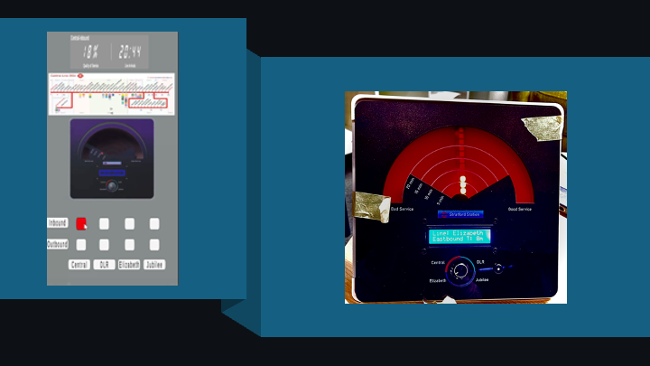
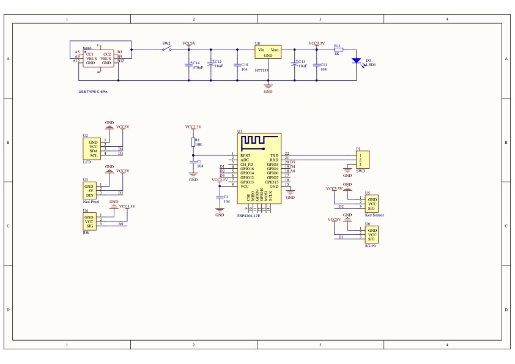

# CASA0019: Sensor Data Visualisation 24/25: SubRadar

  

## Table of Contents
1. [Project Overview](#project-overview)
2. [Enclosure & Industrial Design](#enclosure-&-industrial-design)
3. [Dataset](#dataset)
4. [Device Engineering (Physical & Digital)](#device-engineering)
5. [Challenges & Limitations](#challenges-and-limitations)
6. [How to use](#how-to-use)
7. [References](#references)

## Project Overview
The **SubRadar** project is a sensor-based system that visualizes real-time transportation data for Stratford Underground Station. Combining physical and digital elements, it provides train arrival times, service quality, and directional updates to people working and studying at UCL East. Users interact with the device through a rotary knob, button, and LED indicators.

### Rationale
Oftentimes, when using applications such as Citymapper or Google Maps, it can take some time to plot in a route or check the latest train times. This project therefore aimed to distill this information into a physical dial device, with digital elements, such that students and staff preparing to leave UCL East after class or work would be able to, at a glance, get all the latest information on the nearest underground trains with minimal effort. It was hoped that through a unique radar-inspired dial, this information could be presented to the UCL East audience in a novel and engaging way.

## Enclosure & Industrial Design

### Inspiration
SubRadar draws largely on sources such as classic science fiction. This is because we wanted the appearance of the dial to emulate a vaccum-tube type device in order to make reference to the classic green or red circular radar scopes of the past. The homage to historical radar is intentional; we wanted to emulate this familiar, classic device that also aimed to show the proximity of moving vehicles to a fixed station. 

*An oscilloscope, a type of device that traditionally used a vaccum-tube display (Wikipedia, 2025)*

However, without a vaccuum-tube display available to us, we had to simulate the effect using stage special effect techniques. In particular, we took inspiration from Michael Okuda, the graphic designer for Star Trek: The Next Generation. In an interview with Adam Savage (formerly of Mythbusters), he described how he used lights placed behind dark coloured acrylic to create the impression of a touch-screen display (Savage, 2024). We used a similar approach, with LEDs placed behind frosted acrylic to create the grainy effect of a vaccum-tube display.

*Michael Okuda's backlit graphic designs for Star Trek, affectionately known by fans as 'Okudagrams' (Nguyen, 2015)*

### Main enclosure

The physical design was developed in Fusion360 and printed on a Bambu Lab 3D printer. To make the design look more appealing, inspiration was taken from Jony Ive's earlier designs for Apple, (Ravenscroft, 2019) using Fusion360's NURBS surface manipulation tool to create a curved back shell that creates an optical illusion, making the device look much thinner than it is in reality.

*Screenshots from Fusion360 showing the curved design of the back shell*

### User interface and experience

#### Wirerframes 

#### Front panel with final UI

The final UI was adapted from the wireframe designs to fit the dimensions of the pysical enclosure as built. These were then prepared for UV printing using GIMP and printed on a laser-cut piece of black acrylic. The graphics were printed using a technique very similar to screen printing, with 2 layers of white laid down before the final colour print, in an attempt to ensure the print had sufficient opacity. A piece of frosted red acrylic was chosen instead of the intital transparent purple colour in the original wireframe design, as it offered nice visual effects with the backlighting, that mimicked the appearance of a vaccuum-tube display very well.

## Dataset
**Data Source: [TFL Tube Data](https://api.tfl.gov.uk/swagger/ui/index.html?url=/swagger/docs/v1#!/Line/Line_Arrivals)**

*Used Data:*
| **Field Name**       | **Meaning**                                | **Purpose**                                                                                         |
|-----------------------|--------------------------------------------|-----------------------------------------------------------------------------------------------------|
| `lineName`           | Line name                                  | Used to distinguish data for different lines                                                       |
| `expectedArrival`    | Scheduled arrival time                     | Used to calculate service interval variability                                                     |
| `timeToStation`      | Remaining time to arrival                  | Used to calculate passenger waiting time                                                           |
| `direction`          | Train direction                            | Used to distinguish service levels for different directions                                        |

*Output Data:*
| **Field Name**       | **Meaning**                                | **Purpose**                                                                                         |
|-----------------------|--------------------------------------------|-----------------------------------------------------------------------------------------------------|
| `timeToStation`           | Time for the nearest tube to the station                                 | Notify user                                                       |
| `serviceLevel`    | Line's overall service level(50%*Passenger Waiting Time + 50%*Service Interval Variability)                    |                  Demonstrate the line's service level                                    |

## Device Engineering
### Physical Hardware & Firmware ------------ YouTian Peng & QiQing Dai
#### Hardware Setup
**Components**:
- ESP8266:
- LCD
- NeoPixel
- Rotary Encoder
- Button

  

#### Firmware Design
**Color-Coded Indicators and Pointer**: The device visually represents the service status of different lines (ranging from "Bad Service" to "Good Service") using a color-coded system and a swinging pointer.

**Knob and Button Interaction**: Users can rotate the knob to select specific line information and press the button to switch the train direction between Westbound and Eastbound.

**LED Display**: LED lights on the pointer display the arrival time (in minutes) of the next train, allowing users to quickly assess the waiting time.

### Digital Twin
**Real-Time Station Information**: A digital screen displays detailed station names for the user-selected line, along with real-time updates on service quality.

**Arrival Time**: The device screen updates the arrival time of the next train at the nearest station to ensure timely information.

**Service Quality**: The overall service quality of the selected line is visually represented as a percentage, giving users a clear understanding of the line’s operational status.

## Challenges & Limitations

## Enclosure and product design
Designing and building the enclosure was filled with many challenges, primarily due to the ambitiously curved nature of the rear shell. It took multiple tries to successfully print the component, and the precision of the Bambu Lab printer was largely the reason why the final print succeeded. For the UV printing of the front face with the UI, this turned out to be mostly successful on the first try, but the component still suffered from some of the print being off registration and the black acrylic, though it worked well to prevent light leaking from inside the device, also made it difficult to achieve good print opacity due to the dark base colour, even with 2 white underlayers. If we were to update the device design, with more time, it would be useful to do a few more test prints to ensure the registration is correct. Furthermore, to solve the opacity problem, a lighter colour of acrylic could be used, and black paint applied to the interior face to reduce light leakage.

## HOW TO USE
Launch the App: Open the app and point it at the screen of the data device. Augmented Reality (AR) information will be overlaid on the data device.

**[User Handle Video](https://drive.google.com/drive/folders/1uhCp3n9zvYmw-k7yBAYddTRGSpbOPPon?usp=drive_link)**

## References

Nguyen, W. (2015). *An Ode to the Okudagram.* [online] TREKNEWS.NET. Available at: https://treknews.net/2015/07/23/ode-to-okudagram/ [Accessed 11 Jan. 2025].

Ravenscroft, T. (2019). *Jony Ive’s 10 most revolutionary designs for Apple*. [online] Dezeen. Available at: https://www.dezeen.com/2019/06/28/jony-ive-designs-apple-imac-ipod-iphone/ [Accessed 11 Jan. 2025].

Savage, A. (2024). *Why Star Trek’s Graphic Design Makes Sense.* [online] YouTube. Available at: https://youtu.be/D24tYFIVyv0?si=6iS26g7v1mN3KYin [Accessed 11 Jan. 2025].

Wikipedia (2025). *Oscilloscope.* [online] Wikipedia. Available at: https://en.wikipedia.org/wiki/Oscilloscope [Accessed 11 Jan. 2025].
