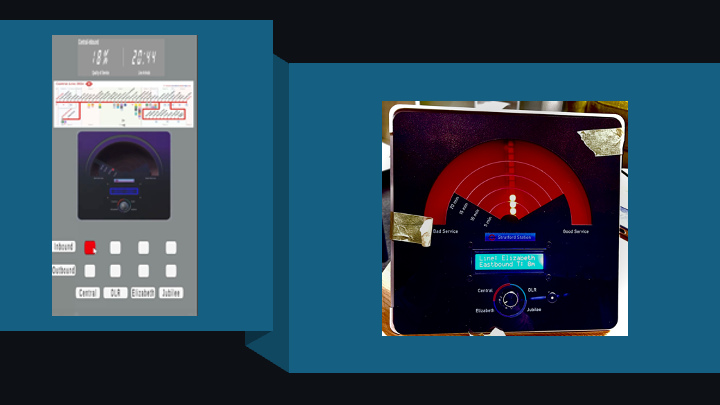

# CASA0019: Sensor Data Visualisation 24/25: SubRadar

  

## Table of Contents
1. [Project Overview](#project--overview)
2. [Design](#design)
3. [Dataset](#dataset)
4. [Data Device (Physical&Digital)](#data-device)
5. [How to use](#how-to-use)
6. [References](#references)

## Project Overview
The **SubRadar** project is a sensor-based system that visualizes real-time transportation data for Stratford Underground Station. Combining physical and digital elements, it provides train arrival times, service quality, and directional updates to people working and studying at UCL East. Users interact with the device through a rotary knob, button, and LED indicators.

### Rationale
Oftentimes, when using applications such as Citymapper or Google Maps, it can take some time to plot in a route or check the latest train times. This project therefore aimed to distill this information into a physical dial device, with digital elements, such that students and staff preparing to leave UCL East after class or work would be able to, at a glance, get all the latest information on the nearest underground trains with minimal effort. It was hoped that through a unique radar-inspired dial, this information could be presented to the UCL East audience in a novel and engaging way.

## Design

### Inspiration
SubRadar draws largely on sources such as classic science fiction and early 21st century consumer gadgets. This is because we wanted the appearance of the dial to emulate a vaccum-tube type device (common in the 20th cenutry) in order to make reference to the classic green or red circular radar scopes of the past. The homage to historical radar is intentional; we wanted to emulate this familiar, classic device that also aimed to show the proximity of moving vehicles to a fixed station. 

*An oscilloscope, a type of device that traditionally used a vaccum-tube display*

### User interface and experience

#### Wirerframes

## Dataset
**Data Source: [TFL Tube Data](https://api.tfl.gov.uk/swagger/ui/index.html?url=/swagger/docs/v1#!/Line/Line_Arrivals)**

*Used Data:*
| **Field Name**       | **Meaning**                                | **Purpose**                                                                                         |
|-----------------------|--------------------------------------------|-----------------------------------------------------------------------------------------------------|
| `lineName`           | Line name                                  | Used to distinguish data for different lines                                                       |
| `expectedArrival`    | Scheduled arrival time                     | Used to calculate service interval variability                                                     |
| `timeToStation`      | Remaining time to arrival                  | Used to calculate passenger waiting time                                                           |
| `direction`          | Train direction                            | Used to distinguish service levels for different directions                                        |

*Output Data:*
| **Field Name**       | **Meaning**                                | **Purpose**                                                                                         |
|-----------------------|--------------------------------------------|-----------------------------------------------------------------------------------------------------|
| `timeToStation`           | Time for the nearest tube to the station                                 | Notify user                                                       |
| `serviceLevel`    | Line's overall service level(50%*Passenger Waiting Time + 50%*Service Interval Variability)                    |                  Demonstrate the line's service level                                    |

## Data Device
### DATA DEVICE (Physical)
**Color-Coded Indicators and Pointer**: The device visually represents the service status of different lines (ranging from "Bad Service" to "Good Service") using a color-coded system and a swinging pointer.

**Knob and Button Interaction**: Users can rotate the knob to select specific line information and press the button to switch the train direction between Westbound and Eastbound.

**LED Display**: LED lights on the pointer display the arrival time (in minutes) of the next train, allowing users to quickly assess the waiting time.

### DATA DEVICE (Digital)
**Real-Time Station Information**: A digital screen displays detailed station names for the user-selected line, along with real-time updates on service quality.

**Arrival Time**: The device screen updates the arrival time of the next train at the nearest station to ensure timely information.

**Service Quality**: The overall service quality of the selected line is visually represented as a percentage, giving users a clear understanding of the line’s operational status.

### 

## HOW TO USE
Launch the App: Open the app and point it at the screen of the data device. Augmented Reality (AR) information will be overlaid on the data device.

**[User Handle Video](https://drive.google.com/drive/folders/1uhCp3n9zvYmw-k7yBAYddTRGSpbOPPon?usp=drive_link)**

## References

